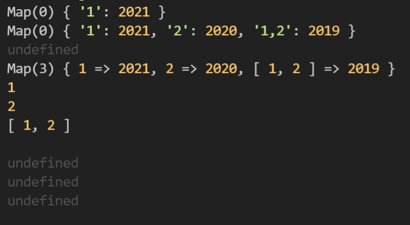
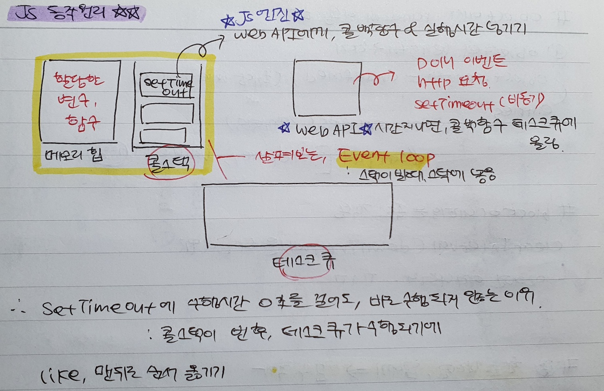

`Table of Keyword`

> [Map의 인덱스접근](#q-map은-인덱스로-할당접근-가능한가)  
> [호이스팅의 오해 -- let,const도 호이스팅됩니다.](#hoisting)  
> [setTimeout 동작원리](#q-settimeout에-수행시간을-0초로-걸어도-바로-실행되지-않는-이유는)  
> [index지만 타입이 달라요]()  
> [함수호이스팅]()

#

### Q. Map은 인덱스로 할당/접근 가능한가?

한줄답변: 인덱스로 접근 불가. 할당은 가능하지만, Object로 작동 돼 Map의 내장함수 사용할 수 없음.

```javascript
let test = new Map();
test[1] = 2021;
// 1. key type은 string으로만 저장됨.
console.log(test); // Map(0) {'1' : 2021}
test[2] = 2020;
test[[1, 2]] = 2019;
console.log(test); // Map(0) { '1': 2021, '2': 2020, '1,2': 2019 }

// 2. Map method 사용 x
console.log(test.get("1")); // undefined
for (let i of test.keys()) {
  console.log(i); // test.keys()가 없어, 반복문 작동 x
}

// 비교 - Map.set()으로 값 할당  -> 잘 작동함
let compare = new Map();
compare.set(1, 2021);
compare.set(2, 2020);
compare.set([1, 2], 2019);
console.log(compare); // Map(3) { 1 => 2021, 2 => 2020, [ 1, 2 ] => 2019 }
for (let c of compare.keys()) {
  console.log(c); // 1  2  [1,2]
  console.log(compare[c]); // undefined - 인덱스 접근 불가
}
```

테스트코드 결과

<p align="center">
  
</p>

참고: [ko.javascript - Map](https://ko.javascript.info/map-set#ref-129)

---

### _hoisting_

**1. 호이스팅은 무엇인가?**  
 호이스팅은 변수의 선언이 코드 상단에 옮겨져서 실행되는 것처럼 작동하는 것을 말한다.

###

**2. 왜 알아야 할까?**  
호이스팅은 자바스크립트 동작방식이기 때문에 알고 있어야한다.  
자바스크립트 엔진은 소스코드를 평가한 뒤, 실행한다.  
소스코드 평가에서 선언된 변수를 찾아내 먼저 실행하기 때문에,  
선언이 코드 상단에 옮겨져서 실행되는 것처럼 보인다.

**const, let도 호이스팅이 이루어진다. 근데 왜 var랑 다르게 작동할까?**

> 변수의 생성과정: 선언 - 초기화 - 할당

이유는 변수의 생성과정에 있다.  
`var`:런타임 이전인 소스코드 평가때, 선언과 초기화(undefined) 함께 이루어진다.  
`let, const`: 소스코드 평가에 선언만 이루어지며, 런타임에 변수 선언문에서 초기화가 이루어진다.

그렇기에 let,const도 호이스팅이 이루어지지만, 참조오류때문에 호이스팅이 작동하지 않는 것처럼 보일뿐이다.

```javascript
console.log(a); // ReferenceError: Cannot access 'a' before initialization
let a = 5;
```

에러메시지를 잘 보면, 초기화 전에 접근했기에 참조오류를 내고있다.  
즉, 변수 a의 선언은 이전에 일어난 것을 알 수 있다.  
\*var, let, const 이외에도 function, class 등 모든 선언은 런타임 이전에 실행된다.

###

**3. 호이스팅 장/단점**  
`장점` 사용할 클래스, 함수 등을 의도적으로 상단에 선언하지 않아도 잘 작동한다.

```javascript
hi("me"); // 선언 전, 실행해도 잘 작동한다. 호이스팅때문!

function hi(name) {
  console.log(`hello world! it's ${name}`);
}
```

`단점` var 처럼 선언과 초기화가 함께 일어날 경우, 에러를 내지 않기에
런타임에 프로그램이 죽어도 원인을 찾기 쉽지 않다.

###

참고

1. https://stackoverflow.com/questions/15005098/why-does-javascript-hoist-variables
2. let, const hoisting: https://junhobaik.github.io/js-let-cont-hoisting/
3. 모던 자바스크립트 deep dive 책 15장, 23장

---

### Q. setTimeout에 수행시간을 0초로 걸어도, 바로 실행되지 않는 이유는?

한줄답변: 콜스택이 빈 후, setTimeout의 콜백함수가 실행되기 때문에

`setTimeout를 언제 써?`  
JS 엔진은 콜스택이 1개다.  
즉, 동시에 하나의 일만 처리할 수 있다는 것이다.  
위에서 아래로 한줄씩 코드를 실행하면서, 바로 동작하는게 아니라 `비동기적으로` 호출하려면 어떻게 할까?  
바로 이럴 때, `setTimeout` `setInterval`을 이용한다.

####

`setTimeout 의 동작원리`

> 1. JS 엔진이 setTimeout의 콜백함수(첫번째인자)를 Web API에 넘긴다
> 2. 주어진 시간이 지나면, 콜백함수를 테스크 큐에 올린다.
> 3. 콜스택이 비면, 이벤트루프가 테스크 큐에 있는 콜백함수를 스택에 넣는다.
> 4. setTimeout의 콜백함수가 실행된다.

<p align="center">
  
</p>

- 추가로 읽어볼 자료
  [js 동작원리 및 이벤트루프](https://kyounghwan01.github.io/blog/JS/JSbasic/eventLoop/#ecmascript%E1%84%8B%E1%85%A6%E1%84%82%E1%85%B3%E1%86%AB-%E1%84%8B%E1%85%B5%E1%84%87%E1%85%A6%E1%86%AB%E1%84%90%E1%85%B3-%E1%84%85%E1%85%AE%E1%84%91%E1%85%B3%E1%84%80%E1%85%A1-%E1%84%8B%E1%85%A5%E1%86%B9%E1%84%83%E1%85%A1)

---

### 일치비교 `===`

고차함수 some, every 의 index → `number`
`for(let i in obj)`의 i → `string`  
\*고차함수는 함수객체를 인수로 주입받는 함수를 말한다.

#### 타입이 왜 다를까?

`for... in`은 객체에 존재하는 `key`를 받아온다.  
이때, object의 key는 `string`만 가능하다.
array의 index는 `number`타입으로 특정 원소에 접근한다.

[프로그래머스 - 위클리(0813)](https://github.com/live-small/problem-solving-/blob/main/programmers/weekly/2%EC%A3%BC%EC%B0%A8.js)  
이 문제를 풀면서, 생각한대로 동작하지 않아 디버깅해보니까 타입이 다르단 걸 알게됐다 😢  
이렇게 정리해보니까 사실 알고있던 내용이었다. 까먹지 말자 !

---

### 함수호이스팅

#### 변수만 호이스팅 할까요? 아뇨. 함수도 해요 + 클래스도..

식별자의 선언은 런타임 전에 JS 엔진에 의해 먼저 실행된다. var, let, const 처럼 함수의 선언도 동일하게 수행된다.
함수를 정의하는 방법에 따라 호이스팅에 차이가 있다.

```javascript
// 1. 함수선언문
function checkNumber(key) {
  return typeof key === "number" ? true : false;
}

// 2. 함수표현식
let CheckNumber = function checkNumber(key) {
  return typeof key === "number" ? true : false;
};
```

1. 함수선언문: 런타임 전에 함수가 선언된 후, 식별자에 함수 객체를 할당한다.  
   → 런타임에, 선언 이전에 호출할 수 있다. **함수 호이스팅**

2. 함수표현식: 변수(식별자)가 선언된 후, 이후 런타임에, 할당문에서 함수 객체가 할당된다.  
   → 런타임에, 선언 이전에 호출할 수 없다. **변수 호이스팅**

#### `정리`

**함수호이스팅** : (함수선언문으로 정의할 경우) 런타임 이전에 함수 객체가 먼저 생성된다.

### TIL 1주차

매일 공부한 걸 공책에 정리하다보니, 여기저기 분산되어있어 찾는데 어려움이 생겼다. 그래서 github에 올리게 된 것이다.  
TIL에서 정리한 조각들을 모아서, 주제별로 블로그 포스팅으로 올릴 생각이다.

`모던 JS deep dive`책 스터디를 하면서 JS에 대해서 깊게 배우고 있다. 내가 알던 JS는 정말 얕은 수준이란 걸 체감하고 있을만큼..! 2주차에 책에서 배운 내용이 많이 올라갈 예정이다.
