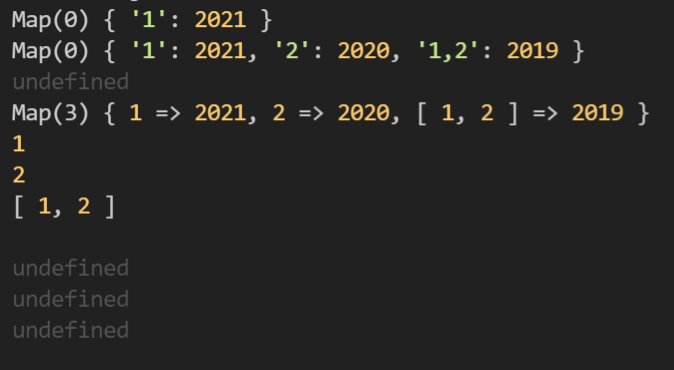

`Table of Keyword`

> [Map의 인덱스접근](#q-map은-인덱스로-할당접근-가능한가)  
> [index지만 타입이 달라요](#일치비교-)

#

### Q. Map은 인덱스로 할당/접근 가능한가?

한줄답변: 인덱스로 접근 불가. 할당은 가능하지만, Object로 작동 돼 Map의 내장함수 사용할 수 없음.

```javascript
let test = new Map();
test[1] = 2021;
// 1. key type은 string으로만 저장됨.
console.log(test); // Map(0) {'1' : 2021}
test[2] = 2020;
test[[1, 2]] = 2019;
console.log(test); // Map(0) { '1': 2021, '2': 2020, '1,2': 2019 }

// 2. Map method 사용 x
console.log(test.get("1")); // undefined
for (let i of test.keys()) {
    console.log(i); // test.keys()가 없어, 반복문 작동 x
}

// 비교 - Map.set()으로 값 할당  -> 잘 작동함
let compare = new Map();
compare.set(1, 2021);
compare.set(2, 2020);
compare.set([1, 2], 2019);
console.log(compare); // Map(3) { 1 => 2021, 2 => 2020, [ 1, 2 ] => 2019 }
for (let c of compare.keys()) {
    console.log(c); // 1  2  [1,2]
    console.log(compare[c]); // undefined - 인덱스 접근 불가
}
```

테스트코드 결과

<p align="center">
  
</p>

참고: [ko.javascript - Map](https://ko.javascript.info/map-set#ref-129)

#

### 일치비교 `===`

고차함수 some, every 의 index → `number`
`for(let i in obj)`의 i → `string`  
\*고차함수는 함수객체를 인수로 주입받는 함수를 말한다.

#### 타입이 왜 다를까?

`for... in`은 객체에 존재하는 `key`를 받아온다.  
이때, object의 key는 `string`만 가능하다.
array의 index는 `number`타입으로 특정 원소에 접근한다.

[프로그래머스 - 위클리(0813)](https://github.com/live-small/problem-solving-/blob/main/programmers/weekly/2%EC%A3%BC%EC%B0%A8.js)  
이 문제를 풀면서, 생각한대로 동작하지 않아 디버깅해보니까 타입이 다르단 걸 알게됐다 😢  
이렇게 정리해보니까 사실 알고있던 내용이었다. 까먹지 말자 !
