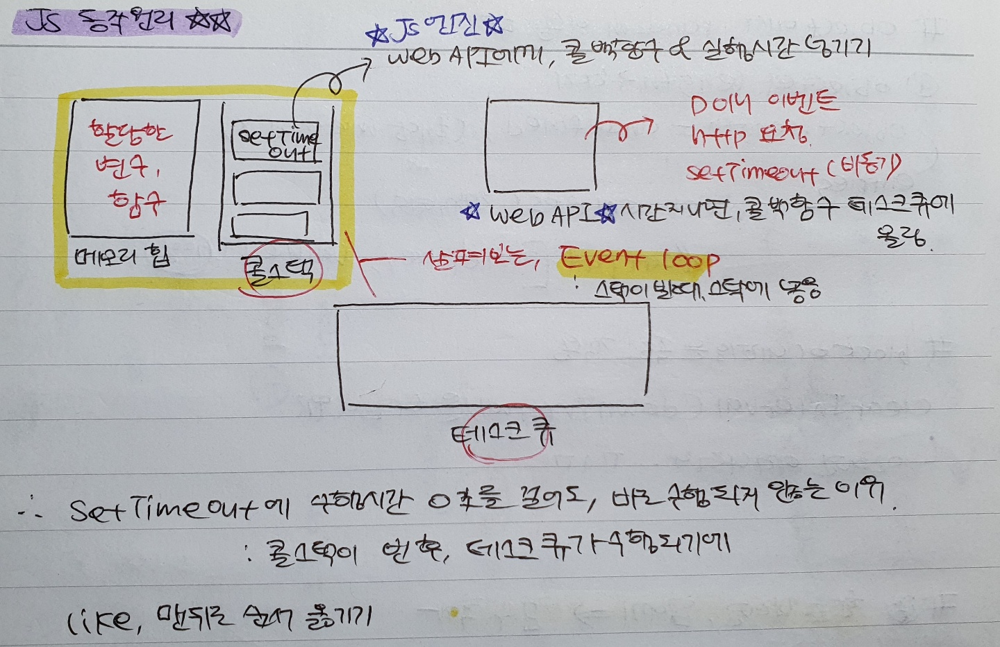

`Table of Keyword`

> [setTimeout 동작원리](#q-settimeout에-수행시간을-0초로-걸어도-바로-실행되지-않는-이유는)

#

### Q. setTimeout에 수행시간을 0초로 걸어도, 바로 실행되지 않는 이유는?

한줄답변: 콜스택이 빈 후, setTimeout의 콜백함수가 실행되기 때문에

`setTimeout를 언제 써?`  
JS 엔진은 콜스택이 1개다.  
즉, 동시에 하나의 일만 처리할 수 있다는 것이다.  
위에서 아래로 한줄씩 코드를 실행하면서, 바로 동작하는게 아니라 `비동기적으로` 호출하려면 어떻게 할까?  
바로 이럴 때, `setTimeout` `setInterval`을 이용한다.

####

`setTimeout 의 동작원리`

> 1. JS 엔진이 setTimeout의 콜백함수(첫번째인자)를 Web API에 넘긴다
> 2. 주어진 시간이 지나면, 콜백함수를 테스크 큐에 올린다.
> 3. 콜스택이 비면, 이벤트루프가 테스크 큐에 있는 콜백함수를 스택에 넣는다.
> 4. setTimeout의 콜백함수가 실행된다.

  

-   추가로 읽어볼 자료
    [js 동작원리 및 이벤트루프](https://kyounghwan01.github.io/blog/JS/JSbasic/eventLoop/#ecmascript%E1%84%8B%E1%85%A6%E1%84%82%E1%85%B3%E1%86%AB-%E1%84%8B%E1%85%B5%E1%84%87%E1%85%A6%E1%86%AB%E1%84%90%E1%85%B3-%E1%84%85%E1%85%AE%E1%84%91%E1%85%B3%E1%84%80%E1%85%A1-%E1%84%8B%E1%85%A5%E1%86%B9%E1%84%83%E1%85%A1)

---
